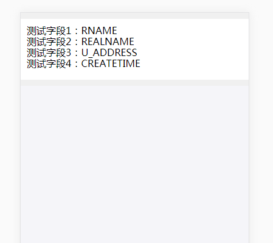

## 通用列表
- 自定义模版
- 增删改查
- 有什么问题找我行不更名坐不改姓ryj
- 需要苦力一起维护，此时请找正奋力为股东们创造价值的zy9

## 示例

* 第一步
   ``` bash
   npm install sc-component-mobile --save
   ```

* 第二步
    * 在模板文件里写html
    ``` html
      render = () => {
          <div className='item'>
              <div>
                  <span>测试字段1：</span>
                  <span data-key='RNAME'>RNAME</span>
              </div>
              <div>
                  <span>测试字段2：</span>
                  <span data-key='REALNAME'>REALNAME</span>
              </div>
              <div>
                  <span>测试字段3：</span>
                  <span data-key='U_ADDRESS'>U_ADDRESS</span>
              </div>
              <div>
                  <span>测试字段4：</span>
                  <span data-key='CREATETIME' format='YYYY-MM-DD'>CREATETIME</span>
              </div>
          </div>
      }
    ``` 
    
    * 效果图  
    
    
* 第三步

    觉着没问题以后再加点细节
    ``` html
       import { Container } from 'sc-component-mobile'

       config = {
           tcid: 1620,
           menuid: 315,
           pageSize: 10,
           // UserId: 1,
           CellPhone: '13900000000',
           // requestUrl: 'http://www.baidu.com',
           // requestParams: {
           //    test1: 'test1',
           //    test2: 'test2',
           //    test3: 'test3',
           // },
           // requestMethod: 'GET',
       }
       
       render = () => {
          <Container config={this.config}>
              <div className='item' bind>
                  <div>
                      <span>测试字段1：</span>
                      <span data-key='RNAME'>RNAME</span>
                  </div>
                  <div>
                      <span>测试字段2：</span>
                      <span data-key='REALNAME'>REALNAME</span>
                  </div>
                  <div>
                      <span>测试字段3：</span>
                      <span data-key='U_ADDRESS'>U_ADDRESS</span>
                  </div>
                  <div>
                      <span>测试字段4：</span>
                      <span data-key='CREATETIME' format='YYYY-MM-DD'>CREATETIME</span>
                  </div>
              </div>
          </Container>
       }
    ```
    
    * 效果图  
    
    
## 最终效果图
    
  这里图跟gif版本没对上，不过大概就是这么个意思了。  
  至于gif里的报错...其实就是演示下大概，再往下看可就要收钱了...

## API
| 参数 | 说明 | 类型 | 默认值 |
| :------: | ----- | :------: | :------: |
| url | true时会用第三方接口 | Boolean |  false |
| bind | 长按和点击事件绑定的地方。上面的例子是绑在整块模版上，于是长按模板就能触发事件，点击也能跳转到详情 | Boolean | true |
| data-key | 物理字段名，需要和接口中的字段对应 | string | 无 |
| bindKey | 如果data-key被占用了，可以把这个属性放到Container上，    ``` <Container bindKey='data-test' />``` ,于是现在绑定物理字段名的key变成data-test了 | string | 'data-key' |
| height | 容器高度 | string或integer | document.body.clientHeight |
| config | 配置，详见下方说明 | {} | 无 |
* 有两种请求方式，默认以tcid和menuid的形式请求数据，但有时会调第三方的接口，url : true的用处就在这了。
* bind会覆盖原有的click和touch事件


## 以下参数都需要写到Container的子标签中
| 参数 | 说明 | 类型 | 默认值 |
| :------: | ----- | :------: | :------: |
| unit | 单位，用在列表页 | string | 无 |
| format | 字段为日期时，格式化字符串 | string | YYYY-MM-DD |
| decimalcount | 浮点数保留位数 | Number | 0 |
* 注：绑定的节点得是底层，就是没子标签的那种，比如上面的CREATETIME。

## config
| 参数 | 说明 | 类型 | 默认值 |
| :------: | ----- | :------: | :------: |
| tcid | 主表id，获取配置和数据 | Number | -1 |
| menuid | 权限id，跟菜单没多大关系，只是需要一个参数来确定长按弹框里显示啥而已 | Number | -1 |
| pageSize | 每页显示多少条，后期会去掉这个参数，换成读主表配置中的参数 | int | 2 |
| UserId | 跟CellPhone一样是确定权限用的。比如给这个用户配置了修改的权限，不传这个参数依旧是不能编辑的，传了才能；当然如果没配置权限的话这个可以不用管。因为各种app外壳获得方式不一样，如果有需要的话自行传入 | Number | -1 |
| CellPhone | 跟UserId二选一即可 | string || Number | null |
| RequestUrl | 非标准接口地址 | string | 无 |
| RequestParams | 非标准接口地址参数，这里可以直接固定搜索参数，可以用在一级页面跳转到二级页面，用带过来的参数搜索。搜索时需要加上AddSearchField字段表示搜索，否则搜索会失效 | object | {} |
| RequestMethod | 非标准接口请求方式 | string | GET |


## pc配置注意项
* 配置项中还没有日期格式化字符串的配置，所以详情页中的日期默认YYYY-MM-DD hh:mm:ss的格式
* 目前导出和导入还未实现，选了也没用
* ControlType=9 时段，实现是有实现，但不符合后端代码对时间处理的要求，可以当成没有
* 我当你精通pc的各配置的，雏的话问问边上的人，或者等我明天或者明天的明天写个具体文档

## 已实现的控件类型
| ControlType | 说明 |
| :---: | :---: |
| 1 | 文本框 |
| 2 | 单日期选择 |
| 3 | 下拉框 |
| 5 | 复选框 |
| 9 | 时段 |
| 99 | label，基本就用在详情页 |

## 番外
    先贤创业未半而中道25，今框架三分，易周疲敝，此诚三组存亡之秋也。然蹙眉之巾帼不懈于内，忠志之士往身于外者，盖追先贤之精致思路，欲报之于移动端也。
    诚宜开张众听，以光先贤遗泽，恢弘志士之气，不宜妄自菲薄，引喻失义，以塞忠谏之路也。
