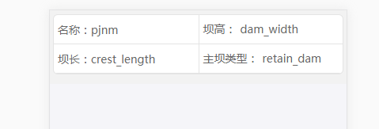

## 通用列表

- 自定义模版
- 增删改查

## 示例

- 第一步

```bash
npm install chika-component --save-dev
```

- 第二步

  ```jsx
  render = () => (
    <ul>
      <li>
        <div className="left">
          <label>名称：</label>
          <label>pjnm</label>
        </div>
        <div className="right">
          <label>坝高：</label>
          <label>dam_width</label>
        </div>
      </li>
      <li>
        <div className="left">
          <label>坝长：</label>
          <label>crest_length</label>
        </div>
        <div className="right">
          <label>主坝类型：</label>
          <label>retain_dam</label>
        </div>
      </li>
    </ul>
  );
  ```

  - 效果图
    

- 第三步

  觉着没问题以后再加点细节

  ```jsx
  import { Container } from 'chika-component';

  handleChange = item => {
    // eslint-disable-next-line
    console.log(item);
  };

  render = () => {
    const params = {
      config: {
        tcid: 10874,
        menuid: 1392,
      },
      sortBy: [
        {
          key: 'dam_width',
          text: '坝高',
        },
        {
          key: 'crest_length',
          text: '坝长',
        },
      ],
      style: {
        height: document.documentElement.clientHeight,
      },
    };

    return (
      <Container {...params}>
        <div className="container" bind="true">
          <ul>
            <li>
              <div className="left">
                <label>名称：</label>
                <label data-key="pjnm" />
              </div>
              <div className="right">
                <label>坝高：</label>
                <label data-key="dam_width" unit="m" decimalcount={2} />
              </div>
            </li>

            <li>
              <div className="left">
                <label>坝长：</label>
                <label data-key="crest_length" unit="m" />
              </div>
              <div className="right">
                <label>主坝类型：</label>
                <label
                  data-key="retain_dam_type"
                  onChange={this.handleChange}
                />
              </div>
            </li>
          </ul>
        </div>
      </Container>
    );
  ```

  - 效果图
    

  - 最终效果图
    
    因为数据问题，侧边栏里搜索项是空的
    还有其它功能没放进 gif，得自行体验了

## API

|        参数         | 说明                                                                                                                                                                |          类型           |           默认值           |
| :-----------------: | ------------------------------------------------------------------------------------------------------------------------------------------------------------------- | :---------------------: | :------------------------: |
|         url         | true 时会用第三方接口                                                                                                                                               |         Boolean         |           false            |
|       bindKey       | 如果 data-key 被占用了，可以把这个属性放到 Container 上，`<Container bindKey='data-test' />` ,于是现在绑定物理字段名的 key 变成 data-test 了                        |         String          |         'data-key'         |
|       height        | 容器高度                                                                                                                                                            |    String 或 Number     | document.body.clientHeight |
|       domain        | 服务地址 domain，如果不传则会请求本地 json，目录在/src/data 中                                                                                                      |         String          |             无             |
| wrappedComponentRef | 替代原先的 ref 获得组件对象以调用其中方法，详情参考[这里](https://github.com/react-component/form#note-use-wrappedcomponentref-instead-of-withref-after-rc-form140) |    {}，用作外部搜索     |             无             |
|     detailArrow     | 详情页翻页箭头是否显示                                                                                                                                              |         Boolean         |           false            |
|       sortBy        | 排序字段                                                                                                                                                            | [{ key: '', text: '' }] |           false            |
|       mapPath       | 地图路由地址                                                                                                                                                        |         string          |       #/easyLeaflet        |
|       config        | 配置，详见下方说明                                                                                                                                                  |           {}            |             无             |

- 有两种请求方式，默认以 tcid 和 menuid 的形式请求数据，但有时会调第三方的接口，url = true 的用处就在这了。
- bind 会覆盖原有的 click 和 touch 事件

## config

|     参数      | 说明                                                                                                                                                                                                   |       类型       | 默认值 |
| :-----------: | ------------------------------------------------------------------------------------------------------------------------------------------------------------------------------------------------------ | :--------------: | :----: |
|     tcid      | 主表 id，获取配置和数据                                                                                                                                                                                |      Number      |   -1   |
|    menuid     | 权限 id，跟菜单没多大关系，只是需要一个参数来确定长按弹框里显示啥而已                                                                                                                                  |      Number      |   -1   |
|   pageSize    | 每页显示多少条，后期会去掉这个参数，换成读主表配置中的参数                                                                                                                                             |       int        |   2    |
|    UserId     | 跟 CellPhone 一样是确定权限用的。比如给这个用户配置了修改的权限，不传这个参数依旧是不能编辑的，传了才能；当然如果没配置权限的话这个可以不用管。因为各种 app 外壳获得方式不一样，如果有需要的话自行传入 |      Number      |   -1   |
|   CellPhone   | 跟 UserId 二选一即可                                                                                                                                                                                   | String 或 Number |  null  |
|  showSearch   | 是否显示搜索面板                                                                                                                                                                                       |     Boolean      |  true  |
|  showButton   | 是否显示右下功能按钮                                                                                                                                                                                   |     Boolean      |  true  |
|  RequestUrl   | 非标准接口地址                                                                                                                                                                                         |      String      |   无   |
| RequestParams | 非标准接口地址参数，这里可以直接固定搜索参数，可以用在一级页面跳转到二级页面，用带过来的参数搜索。搜索时需要加上 AddSearchField 字段表示搜索，否则搜索会失效                                           |        {}        |
| RequestMethod | 非标准接口请求方式                                                                                                                                                                                     |      String      |  GET   |

## 以下参数都需要写到 Container 的子标签中

|     参数     | 说明                                                                                               |    类型    |   默认值   |
| :----------: | -------------------------------------------------------------------------------------------------- | :--------: | :--------: |
|     unit     | 单位，用在列表页                                                                                   |   String   |     无     |
|    format    | 字段为日期时，格式化字符串                                                                         |   String   | YYYY-MM-DD |
|     bind     | 长按和点击事件绑定的地方。上面的例子是绑在整块模版上，于是长按模板就能触发事件，点击也能跳转到详情 |  Boolean   |    true    |
|   data-key   | 物理字段名，需要和接口中的字段对应                                                                 |   String   |     无     |
| decimalcount | 浮点数保留位数                                                                                     |   Number   |     0      |
|   onChange   | 点击事件，会覆盖跳转详情，会传出当前格子数据                                                       | item => {} |     无     |

- 绑定的节点得是底层，就是没子标签的那种，比如上面的 CREATETIME。
- 在使用 onChange 时，如果原来的标签上有 onClick 可能会冲突。这个没辙

## pc 配置注意项

- 配置项中还没有日期格式化字符串的配置，所以详情页中的日期默认 YYYY-MM-DD HH:mm:ss 的格式
- 目前导出和导入还未实现，选了也没用
- ControlType=9 时段，实现是有实现，但不符合后端代码对时间处理的要求，可以当成没有

## 已实现的控件类型

| ControlType |          说明           |
| :---------: | :---------------------: |
|      1      |         文本框          |
|      2      |       单日期选择        |
|      3      |         下拉框          |
|      5      |         复选框          |
|      9      |          时段           |
|     14      |        地图选址         |
|     99      | label，基本就用在详情页 |
