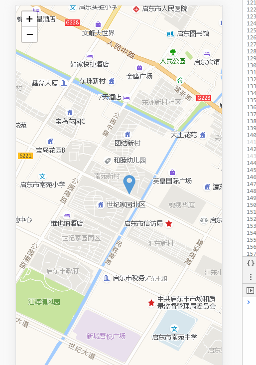

# MapBox

A package of Leaflet, with basic usage using react

## Screenshots



## Usage

```js
import React from 'react';
import { MapBox } from 'chika-component';

export default () => (
  <MapBox onMarkerMove={({ lat, lng }) => console.log(lat, lng)} />
);
```

## API

### MapBox props

|       name        | description                            |                 type                 |    default    |
| :---------------: | -------------------------------------- | :----------------------------------: | :-----------: |
|       type        | tile type, check [TileType](#TileType) |        [TileType](#TileType)         | gdTrafficTile |
|   markerVisible   | visible of marker                      |               boolean                |     true      |
|  markerDraggable  | whether marker can be dragged          |               boolean                |     true      |
|    onMoveStart    |                                        | ({lng: string; lat: string}) => void |               |
|      onMove       |                                        | ({lng: string; lat: string}) => void |               |
|     onMoveEnd     |                                        | ({lng: string; lat: string}) => void |               |
|    onDragStart    |                                        | ({lng: string; lat: string}) => void |               |
|      onDrag       |                                        | ({lng: string; lat: string}) => void |               |
|     onDragEnd     |                                        | ({lng: string; lat: string}) => void |               |
| onMarkerMoveStart |                                        | ({lng: string; lat: string}) => void |               |
|   onMarkerMove    |                                        | ({lng: string; lat: string}) => void |               |
|  onMarkerMoveEnd  |                                        | ({lng: string; lat: string}) => void |               |
| onMarkerDragStart |                                        | ({lng: string; lat: string}) => void |               |
|   onMarkerDrag    |                                        | ({lng: string; lat: string}) => void |               |
|  onMarkerDragEnd  |                                        | ({lng: string; lat: string}) => void |               |

### TileType

```tsx
enum TileType {
  'gdTrafficTile',
  'gdSatelliteTile',
  'googleTile',
  'googleRsTile',
  'googleTrafficTile',
}
```
