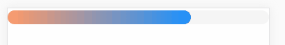

## 进度条
- 颜色渐变
- 浮光滚动

## 示例

* 第一步  
在package.json的dependencies里加入``` "react-mobile-component": "git+https://github.com/zy410419243/react-mobile-component.git" ```  

    npm install  

* 第二步
    ``` html
        render = () => {
          return (
              <div className='Progress_demo'>
                  <Progress percent={ 70 } height={ 20 } start='#F96' end='#1890ff' active />
              </div>
          )
      }
    ``` 
    
    * 效果图  
    

## API
| 参数 | 说明 | 类型 | 默认值 |
| :------: | ----- | :------: | :------: |
| percent | 进度条长度 | number | 50 |
| height | 进度条高度 | number 或 string | 8 |
| start | 渐变开始颜色 | string | 无 |
| end | 渐变结束颜色 | string | 无 |
| active | 是否带有浮光 | boolean | false |
| customImage | 自定义background-image。和start-end二选一，优先start-end | string | '' |