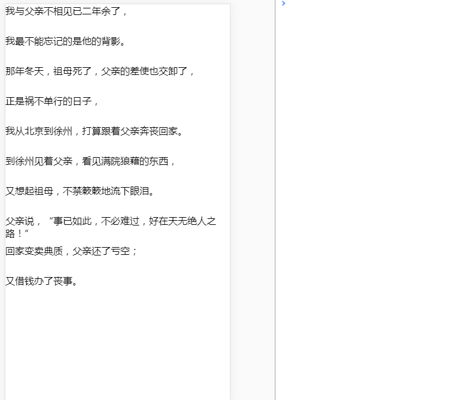

# Swiper

[English](./README.md) | 简体中文

拖动刷新、加载

## 示例

https://zy410419243.github.io/chika-component/#/swiper



## 用法

```js
import React from 'react';
import { Swiper } from 'chika-component';

class Demo extends React.Component {
  state = { loading: false };

  onChange = () => {
    this.setState({ loading: true });
    setTimeout(() => {
      this.setState({ loading: false });
    }, 1000);
  };

  render() {
    return (
      <Swiper
        wrapperHeight={500}
        duration={0.7}
        sensibility={1}
        onRefresh={this.onChange}
        onLoad={this.onChange}
        loading={loading}
      >
        <ul>
          {['test1', 'test2', 'test3'].map((item, i) => {
            return (
              <li key={i} style={{ height: 300 }}>
                {item}
              </li>
            );
          })}
        </ul>
      </Swiper>
    );
  }
}
```

## API

### Swiper props

|     name      | description                                        |    type    |          default           |
| :-----------: | -------------------------------------------------- | :--------: | :------------------------: |
| wrapperHeight | 容器高度                                           |   number   | document.body.clientHeight |
|    loading    | 是否显示刷新状态                                   |  boolean   |           false            |
|  sensibility  | 拖动时的灵敏度。值越大，单位时间内拖动时的距离越长 |   number   |             1              |
|   duration    | 过渡动画持续时间                                   |   number   |             1              |
|   onRefresh   | 刷新时触发事件                                     | () => void |             -              |
|    onLoad     | 加载时触发事件                                     | () => void |             -              |

Note: content height should more than `wrapperHeight`, or `onLoad` will not work
Note: 本体内容需要大于 `wrapperHeight`，否则无法触发 `onLoad`
