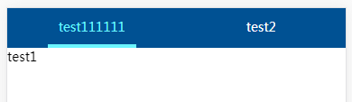

## 页签
- 过渡及点击效果
- 样式可配
- 受控

## 效果
    
  
## 示例
``` html
   onClick = (item, currentSelect) => {
        this.setState({currentSelect});
    }

    config = {
        // containerStyle: {background: '#F96'}
    }

    render() {
        const {result,currentSelect} = this.state;

        return (
            <div className='Tabs_demo'>
                <Tabs currentSelect={currentSelect} onClick={this.onClick} config={this.config}>
                    <div label='test111111'>test1</div>
                    <div label='test2'>test2</div>
                </Tabs>
            </div>
        )
    }
``` 
  
## API
| 参数 | 说明 | 类型 | 默认值 |
| :------: | ----- | :------: | :------: |
| onClick | 点击事件 | Function | (item, currentSelect) => {} |
| currentSelect | 页签当前选中项。因为是受控的组件，所以记得把onClick中传出的currentSelect传回来 | Number |  0 |
| label | 页签项的名字，需要被Tabs包裹。label可以是一个对象，如果需要在点击时传出其他奇怪的属性的话，但其中一定要有label这个属性，用于页签项名称 | string或object | 无 |
| config | 配置，详见下方说明 | {} | 无 |

# config
| 参数 | 说明 | 类型 | 默认值 |
| :------: | ----- | :------: | :------: |
| containerStyle | 页签容器样式 | {} | 无 |
| fontStyle | 页签项样式，主要用于改字体颜色 | {} | 无 |
| undelineStyle | 下划线样式。下划线跟页签项属于不同的div，所谓的下划线就是div的border | {} | 无 |
